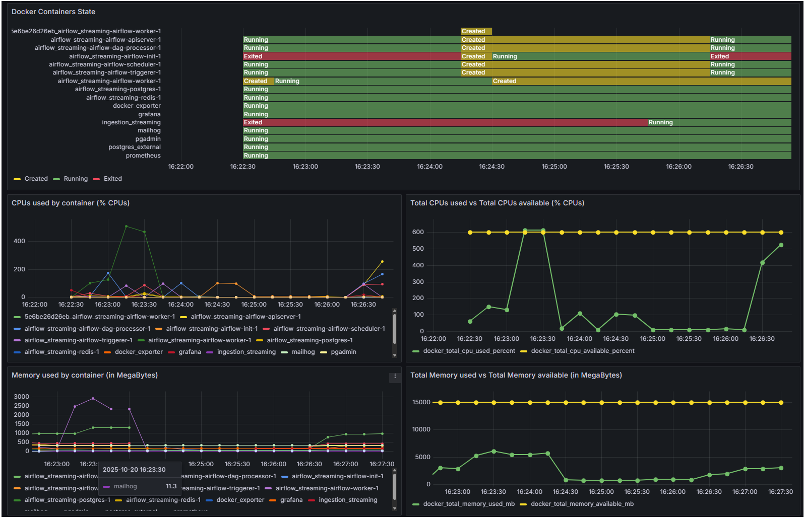

# Docker Monitoring Dashboard for Windows

Monitor your Docker containers on Windows using Docker Desktop, Prometheus, and Grafana.

## Pre-requisites

* docker on windows
* docker-desktop on windows
* docker-compose

## Setup and Installation

1. In Docker Desktop, go to **Settings → General** and check the box  
   **“Expose daemon on tcp://localhost:2375 without TLS”**. (for some versions, restart Docker Desktop)

2. Clone this repository on your Windows machine where Docker is already running.

3. Open PowerShell in the repository folder and run:
```
docker-compose up -d
```

Here is the installation tutorial video:
https://youtu.be/LkaQknRLcgk

## Configuration

By default, the services are accessible on the following URLs:

Docker-exporter: http://localhost:8000/

Prometheus: http://localhost:9090/targets

Grafana: http://localhost:3000/login
(Grafana default user/pass : admin/admin)

## Want to enable email alerts in your monitoring setup?

Follow the step-by-step guide here: [Grafana Email Alert Tutorial](grafana_email_alert_tutorial.md)

## Screenshot

Grafana Dashboard


---

If you enjoy this project, ⭐ please give it a star!